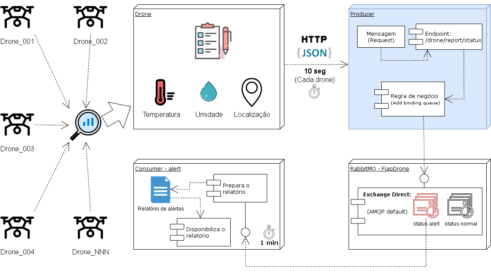
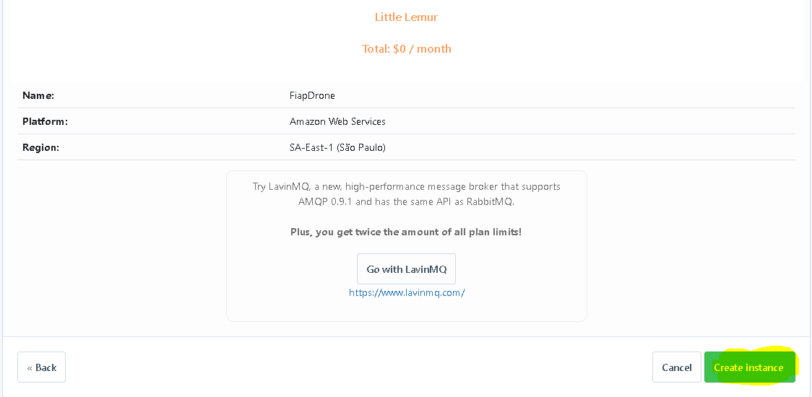

# PRODUCER

---

## OVERVIEW



---

### GRUPO

- RM346315: Lais Kagawa
- RM346511: Jônatha Lacerda Gonzaga
- RM346958: Thiago de Souza Zanella
- <del> RM347277: Gustavo de Oliveira Freitas</del> (Desistiu do curso)

---

### REPOSITÓRIOS RELACIONADOS

- https://github.com/lakagawa/drone
- https://github.com/jhowlacerda/consumer

---

### FERRAMENTAS DE INTEGRAÇÃO

- Slack
- Github
- Trello
- RabbitMQ
- Draw.io

---

## PARA TESTAR

### Configure o ambiente

#### Versão do java


#### Execução com o spring boot/gradle


#### RabbitMQ 





#### Execute esta aplicação e escolha um dos métodos abaixo para executar o comando de teste:
  - Executar diretamente do prompt de comando;
  - Intellij: É necessário que o terminal da IDE esteja configurado para executar com o **cmd.exe**:


#### Execute o teste!
Caso tenha optado pela IDE Intellij, clique no símbolo verde ao lado esquerdo do comando abaixo:
```shell
curl -X POST http://localhost:8080/drone/report/status --header "Content-Type: application/json" -d "@src/test/resources/ReportStatusNormal.json"
```
```shell
curl -X POST http://localhost:8080/drone/report/status --header "Content-Type: application/json" -d "@src/test/resources/ReportStatusAlert.json"
```

Exemplo de conteúdo do teste:
```json
{
  "idDrone": "DRONE_NNN",
  "latitude": -14.739023157961602,
  "longitude": -75.13000484778613,
  "temperatura": 30,
  "umidade": 15
}
```

### Resultado esperado

#### Exchange


#### Queue


--- 

#### REFERÊNCIAS

- [CloudAMQP - RabbitMQ](https://customer.cloudamqp.com/instance/)
- [Draw.io](https://app.diagrams.net)
- [RabbitMQ: Exchange Types - Topic vs Direct](https://www.nastel.com/rabbitmq-topic-vs-direct-exchange)
