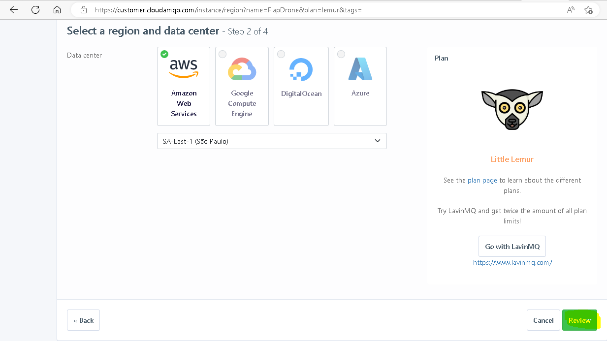

# PRODUCER

---

## OVERVIEW


---

### GRUPO

- RM346315: Lais Kagawa
- RM346511: Jônatha Lacerda Gonzaga
- RM346958: Thiago de Souza Zanella
- <del> RM347277: Gustavo de Oliveira Freitas</del> (Desistiu do curso)

---

### REPOSITÓRIOS RELACIONADOS

- https://github.com/lakagawa/drone

---

### FERRAMENTAS DE INTEGRAÇÃO

- Slack
- Github
- Trello
- RabbitMQ
- Draw.io

---

## PARA TESTAR

### Configure o ambiente

#### Versão do java


#### Execução com o spring boot/gradle


#### RabbitMQ 





#### Execute esta aplicação e escolha um dos métodos abaixo para executar o comando de teste:
  - Executar diretamente do prompt de comando;
  - Intellij: É necessário que o terminal da IDE esteja configurado para executar com o **cmd.exe**:


#### Execute o teste!
Caso tenha optado pela IDE Intellij, clique no símbolo verde ao lado esquerdo do comando abaixo:
```shell
curl -X POST http://localhost:8080/drone/report/status --header "Content-Type: application/json" -d "@src/test/resources/ReportStatus.json"
```


Conteúdo do teste (presente no arquivo [ReportStatus.json](src/test/resources/ReportStatus.json) )
```json
{
  "idDrone": "DRONE_123",
  "latitude": "123456789",
  "longitude": "-987654321",
  "temperatura": 40,
  "umidade": 90,
  "rastreamento": true
}
```

--- 

#### REFERÊNCIAS

- [CloudAMQP - RabbitMQ](https://customer.cloudamqp.com/instance/)
- [Draw.io](https://app.diagrams.net)
